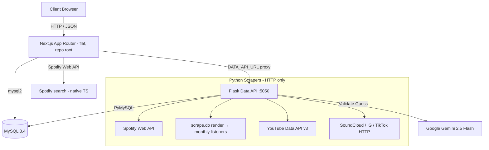

# Incighder

Incighder is a professional data application designed to help recording artists, A&Rs, and music labels understand an artist's online traction, audience reach, and growth trajectory. By aggregating public metrics from key music and social platforms, Incighder provides a holistic view of artist performance and traction over time.

---

## Key Features

- **Multi-Platform Metric Harvesting**:
  - **Spotify**: Collects follower counts, popularity scores, genres, and top tracks (Web API), plus monthly listeners (via the scrape.do render API).
  - **YouTube**: Fetches subscriber counts, lifetime video views, video counts, and details of their top-performing video (using the official YouTube Data API v3).
  - **SoundCloud**: Resolves profile URLs to extract follower counts, total tracks, and top track statistics.
  - **Instagram**: Retrieves follower counts and verified status.
  - **TikTok**: Collects follower counts, total likes, and video counts.
  - **X (Twitter)**: Supports manual input of followers to respect login-wall restrictions.
- **Anti-Ban Scraping Architecture**:
  - Implements a strict **24-hour cache TTL** (per platform) to keep traffic minimal.
  - Throttles requests sequentially with random jitter (delay range configurable).
  - Employs realistic headers, per-host serialization, and automatic backoffs (`429`/`403`). HTTP-only — no headless browser.
  - Graceful degradation: A failure on one platform never blocks the retrieval of data from other platforms.
- **Artist Discovery** (`/discover`):
  - Enter a seed artist and get a grid of **similar artists** to scout, powered by the free **Last.fm `getSimilar`** graph (Spotify's related-artists API was retired in late 2024).
  - Each result is enriched with Spotify metrics (followers, popularity, top track) plus Last.fm global listeners, playcount, and tags, and shows a similarity match score.
  - **One-click "Track"** ingests any similar artist into the dataset via the existing insert pipeline; artists you already track are marked so you only add what's new.
- **Auto-Discovery & AI Verification**:
  - Automatically searches for and suggests official YouTube channels and SoundCloud profiles.
  - For Instagram and TikTok, runs a free **web search** (Google Programmable Search) for the artist on that platform and collects real candidate profiles — so it finds accounts even when the handle differs from the artist's name (a preferred handle was taken, stage vs. legal name, etc.), which a blind name-guess never could.
  - Uses **Google Gemini** (`gemini-2.5-flash`) to inspect each candidate's profile metadata/preview and decide whether it belongs to the artist (`match` / `uncertain` / `mismatch`); the best match is auto-filled and the runners-up are offered as **alternates** you can switch to in one click.
- **Historical Growth Analytics**:
  - Automatically captures account-keyed metric snapshots in the database when new data is pulled.
  - A background **auto-scrape scheduler** sweeps all tracked artists on a recurring interval (default 24h, TTL-respected), so growth history accrues without manual scraping.
  - Renders inline metric sparklines on the dashboard.
  - Features a dedicated historical section showing growth trends since tracking began.
- **Modern Sleek Design System**:
  - A responsive dark slate and cyan visual identity powered by Next.js, Tailwind CSS, and shadcn-inspired components.

---

## Technical Stack

- **Frontend**: Next.js 15 (React 19, TypeScript, Tailwind CSS, Lucide icons, shadcn UI components) — a **flat app at the repo root**, Vercel-ready.
- **Backend Orchestrator**: Next.js API Routes. DB access and Spotify search are **native TypeScript** (`mysql2`); the remaining scraping/discovery endpoints proxy to the Python service via `DATA_API_URL`.
- **Data API Service**: Python (Flask + gunicorn on :5050, Spotipy, `PyMySQL`, BeautifulSoup4, Lxml, requests). **HTTP-only — no headless browser.**
- **Database**: MySQL 8.4 (local via Homebrew `mysql@8.4`).
- **AI Verification**: Google Gemini (`gemini-2.5-flash`).
- **Spotify monthly listeners**: the [scrape.do](https://scrape.do) render API (the one JS-gated metric a browser-free fetch can't get).
- **Run**: native, **no Docker** (`./start_dev.sh`).

---

## System Architecture



---

## Setup and Running the Application

### Prerequisites (macOS, native — no Docker)

- [Homebrew](https://brew.sh/) — for MySQL: `brew install mysql@8.4`
- Node 18+ and Python 3.12 (`brew install python@3.12`)
- Git

### 1. Clone the Repository

```bash
git clone [YOUR_REPOSITORY_URL]
cd incighder
```

### 2. Configure Environment Variables

Create a `.env` file in the root of the project:

```env
# Spotify API Credentials (Required for search & initial metadata)
SPOTIFY_CLIENT_ID=your_spotify_client_id
SPOTIFY_CLIENT_SECRET=your_spotify_client_secret

# YouTube Data API Key (Required for YouTube scraping & channel discovery)
YOUTUBE_API_KEY=your_youtube_api_key

# Last.fm API Key (Required for the /discover similar-artists feature)
LAST_FM_API_KEY=your_lastfm_api_key

# Google Gemini (Required for AI-verified auto-discovery — gemini-2.5-flash)
GOOGLE_AI_API_KEY=your_google_ai_api_key

# scrape.do render API (Required for Spotify monthly listeners — the one metric
# that needs a rendered browser, which scrape.do provides over HTTP)
SCRAPE_DO_TOKEN=your_scrape_do_token

# Instagram session cookie (Optional but recommended; the `sessionid` cookie from
# instagram.com makes the IG follower lookup reliable instead of login-walled)
IG_SESSIONID=your_instagram_sessionid_cookie

# Google Programmable Search (Optional; powers search-backed Instagram/TikTok
# auto-discovery. Without it, discovery falls back to a name-slug guess.)
GOOGLE_CSE_KEY=your_google_api_key
GOOGLE_CSE_ID=your_cse_cx_id

# Database (Optional; defaults shown — local MySQL)
DB_HOST=127.0.0.1
DB_PORT=3306
DB_USER=incighder
DB_PASSWORD=password
DB_NAME=incighder

# Data API base URL the frontend proxies to (Optional; default localhost:5050.
# Set to a public URL when the data-api is hosted separately, e.g. on Vercel.)
DATA_API_URL=http://127.0.0.1:5050

# Scraping Throttle Configuration (Optional; defaults to 2.0s and 6.0s)
SCRAPE_THROTTLE_MIN=2.0
SCRAPE_THROTTLE_MAX=6.0

# Auto-scrape scheduler (Optional; defaults to a 24h sweep interval)
AUTO_SCRAPE_INTERVAL_HOURS=24
```

### 3. Running the Application

One command brings up everything (MySQL, the data-api, and the frontend):

```bash
./start_dev.sh
```

On first run it creates the Python venv, installs deps, and applies the schema. Once up, the frontend is at [http://localhost:3000](http://localhost:3000) and the data-api at `:5050`.

First-time MySQL setup (create the DB + user once):

```sql
CREATE DATABASE incighder CHARACTER SET utf8mb4 COLLATE utf8mb4_unicode_ci;
CREATE USER 'incighder'@'localhost' IDENTIFIED BY 'password';
GRANT ALL PRIVILEGES ON incighder.* TO 'incighder'@'localhost';
```

#### Database Schema Application (First-time Setup or Reset)
To wipe and reset the schema:

```bash
cd data-api && ./.venv/bin/python apply_schema.py
```

### 4. Running pieces individually

- **Frontend only**: `npm run dev` (at the repo root)
- **Data API only**: from `data-api/`, run the venv gunicorn (see `start_dev.sh`)
- **Scheduler** (optional auto-scrape): `cd data-api && ./.venv/bin/python scheduler.py`

### Deploying to Vercel

The frontend is a flat project Vercel auto-detects. For a live deploy you'll need a **hosted MySQL** (set the `DB_*` env vars) and either a **hosted data-api** (set `DATA_API_URL`) or the remaining endpoints ported to TS. See `ai/PROJECT_STATE.md` for the deep tech-debt around datacenter-IP scraping limits.


---

## Usage Guide

- **Home Page (`/`)**: Displays card layouts of all tracked artists, showcasing their key indicators (Spotify popularity, followers, top track metrics) and visual sparklines showing metric history.
- **Table View (`/table`)**: A spreadsheet-style breakdown displaying all platform follower counts side-by-side. Sortable by platform metrics.
- **Discover (`/discover`)**: Enter a seed artist to surface similar artists (Last.fm) enriched with Spotify and Last.fm metrics; one-click "Track" adds any of them to the dataset, with already-tracked artists marked.
- **Add Artist (`/artists/add`)**: Search for an artist on Spotify and ingest their baseline metrics into the local MySQL database, or add an artist manually when they aren't on Spotify.
- **Artist Detail (`/artists/[id]`)**:
  - Displays detailed stats grids and a track summary, with inline editing of artist fields and the option to remove a tracked artist.
  - Shows growth metrics and a history panel tracing historical subscriber metrics.
  - **Sources & Scraping Control Panel**: Paste platform profile URLs, trigger auto-discovery, or invoke a manually-triggered scrape (which obeys the 24h TTL or bypasses it with a "Force Refresh" toggle). Displays the success or error status of the latest scrapers.

---

## Future Enhancements (Roadmap)

- **Bulk Artist Import**: Ingest a batch of artist names or Spotify IDs in a single operation.
- **Data Exporting**: Export metric sets to CSV or JSON formats for custom analysis.
- **Weighted Analytics Score**: Combine metrics from all platforms into a single weighted health/traction score.