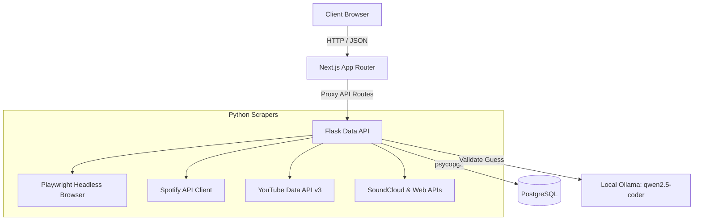

# Incighder

Incighder is a professional data application designed to help recording artists, A&Rs, and music labels understand an artist's online traction, audience reach, and growth trajectory. By aggregating public metrics from key music and social platforms, Incighder provides a holistic view of artist performance and traction over time.

---

## Key Features

- **Multi-Platform Metric Harvesting**:
  - **Spotify**: Collects follower counts, popularity scores, genres, top tracks, and monthly listeners (via a robust scraper).
  - **YouTube**: Fetches subscriber counts, lifetime video views, video counts, and details of their top-performing video (using the official YouTube Data API v3).
  - **SoundCloud**: Resolves profile URLs to extract follower counts, total tracks, and top track statistics.
  - **Instagram**: Retrieves follower counts and verified status.
  - **TikTok**: Collects follower counts, total likes, and video counts.
  - **X (Twitter)**: Supports manual input of followers to respect login-wall restrictions.
- **Anti-Ban Scraping Architecture**:
  - Implements a strict **24-hour cache TTL** (per platform) to keep traffic minimal.
  - Throttles requests sequentially with random jitter (delay range configurable).
  - Employs realistic headers, browser stealth options, and automatic backoffs (`429`/`403`).
  - Graceful degradation: A failure on one platform never blocks the retrieval of data from other platforms.
- **Auto-Discovery & AI Verification**:
  - Automatically searches for and suggests official YouTube channels and SoundCloud profiles.
  - Generates best-guess candidate handles for Instagram and TikTok.
  - Uses a **local LLM via Ollama** (`qwen2.5-coder:14b`) to inspect profile metadata and previews, deciding if a guessed link belongs to the artist (`match` / `uncertain` / `mismatch`) before it is scraped.
- **Historical Growth Analytics**:
  - Automatically captures account-keyed metric snapshots in the database when new data is pulled.
  - Renders inline metric sparklines on the dashboard.
  - Features a dedicated historical section showing growth trends since tracking began.
- **Modern Sleek Design System**:
  - A responsive dark slate and cyan visual identity powered by Next.js, Tailwind CSS, and shadcn-inspired components.

---

## Technical Stack

- **Frontend**: Next.js (React 19, TypeScript, Tailwind CSS, Lucide icons, shadcn UI components)
- **Backend Orchestrator**: Next.js API Routes (proxies requests to the Python service)
- **Data API Service**: Python (Flask, Playwright for headless browser rendering, BeautifulSoup4, Lxml, Spotipy, and requests)
- **Database**: PostgreSQL 13 (configured for development with write caching turned off)
- **Local AI Verification**: Ollama (orchestrated over Docker network bridge to host endpoint)

---

## System Architecture



---

## Setup and Running the Application

### Prerequisites

- [Docker Desktop](https://www.docker.com/products/docker-desktop)
- Git
- (Optional) [Ollama](https://ollama.com/) running on your host machine if using AI-verified discovery.

### 1. Clone the Repository

```bash
git clone [YOUR_REPOSITORY_URL]
cd incighder
```

### 2. Configure Environment Variables

Create a `.env` file in the root of the project:

```env
# Spotify API Credentials (Required for search & initial metadata)
SPOTIFY_CLIENT_ID=your_spotify_client_id
SPOTIFY_CLIENT_SECRET=your_spotify_client_secret

# YouTube Data API Key (Required for YouTube scraping & channel discovery)
YOUTUBE_API_KEY=your_youtube_api_key

# Local Ollama URL (Optional; defaults to http://host.docker.internal:11434 for Docker)
OLLAMA_URL=http://host.docker.internal:11434
OLLAMA_MODEL=qwen2.5-coder:14b

# Scraping Throttle Configuration (Optional; defaults to 2.0s and 6.0s)
SCRAPE_THROTTLE_MIN=2.0
SCRAPE_THROTTLE_MAX=6.0
```

### 3. Development Workflow Scripts

We provide several convenience scripts in the root directory:

- **`./start_dev.sh`**: Stops all active containers, purges dev database volumes, rebuilds all images (installing Playwright dependencies), applies the SQL schema, and starts all services. **Use this for a fresh installation or schema reset.**
- **`./start_db.sh`**: Boots only the PostgreSQL database.
- **`./start_data_api.sh`**: Boots the Flask service (auto-starts the database if not running).
- **`./start_incighder_dev.sh`**: Boots the Next.js development server in the foreground, streaming logs directly. Auto-starts dependee services.

To spin up the entire stack, run:
```bash
./start_dev.sh
```
Once healthy, the frontend is accessible at [http://localhost:3000](http://localhost:3000).

### 4. Stopping the services

```bash
docker-compose down
```

---

## Usage Guide

- **Home Page (`/`)**: Displays card layouts of all tracked artists, showcasing their key indicators (Spotify popularity, followers, top track metrics) and visual sparklines showing metric history.
- **Table View (`/table`)**: A spreadsheet-style breakdown displaying all platform follower counts side-by-side. Sortable by platform metrics.
- **Add Artist (`/artists/add`)**: Search for an artist on Spotify and ingest their baseline metrics into the local PostgreSQL database.
- **Artist Detail (`/artists/[id]`)**:
  - Displays detailed stats grids and a track summary.
  - Shows growth metrics and a history panel tracing historical subscriber metrics.
  - **Sources & Scraping Control Panel**: Paste platform profile URLs, trigger auto-discovery, or invoke a manually-triggered scrape (which obeys the 24h TTL or bypasses it with a "Force Refresh" toggle). Displays the success or error status of the latest scrapers.

---

## Future Enhancements (Roadmap)

- **Bulk Artist Import**: Ingest a batch of artist names or Spotify IDs in a single operation.
- **Automated Scraping Scheduler**: Set up recurring cron jobs to pull metrics automatically at night.
- **Data Exporting**: Export metric sets to CSV or JSON formats for custom analysis.
- **Weighted Analytics Score**: Combine metrics from all platforms into a single weighted health/traction score.